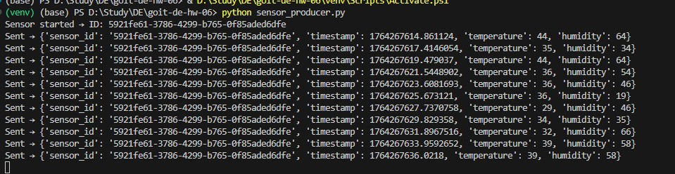
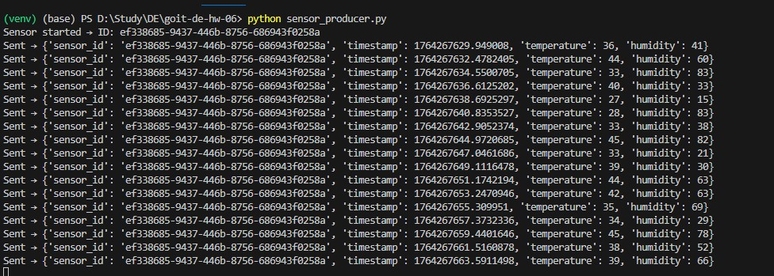
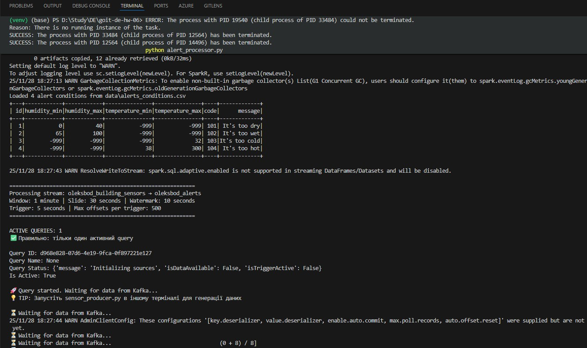
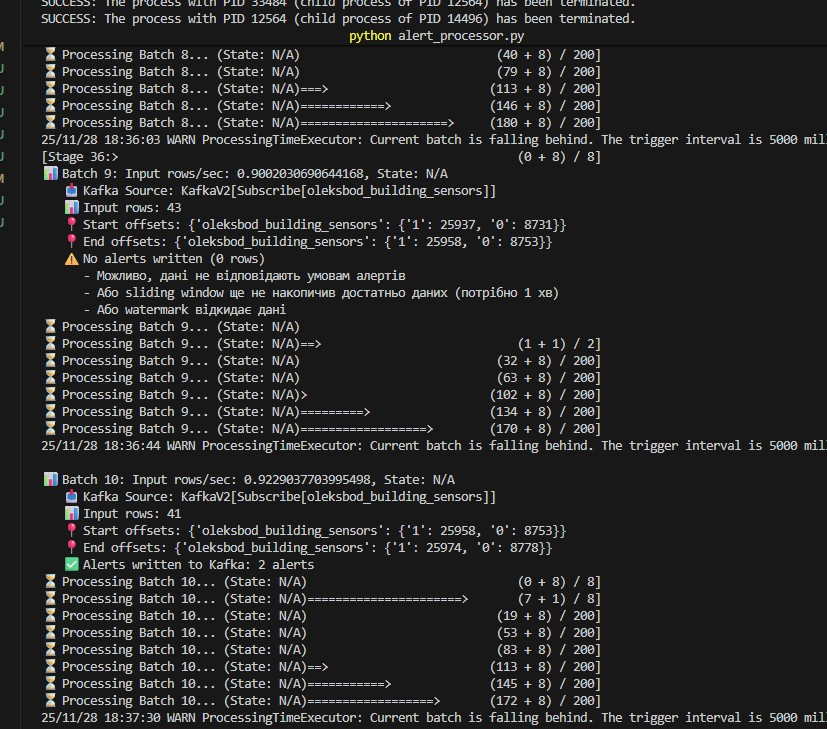
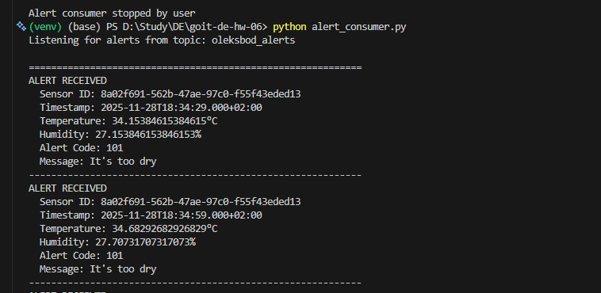
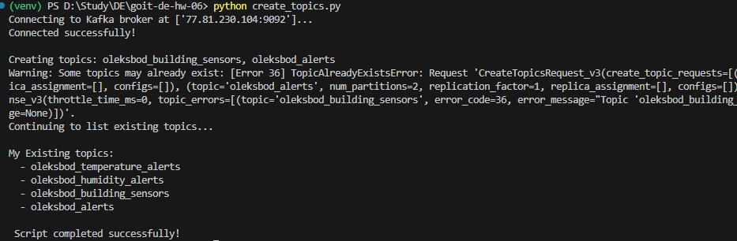

# Spark Streaming - Система моніторингу IoT датчиків

## Опис завдання

Необхідно для потоку даних з Kafka-топіку, що генерується сенсорами, створити програму, яка буде аналізувати дані та записувати алерти в alert-Kafka-топік за виконання певних умов.

## Покрокова інструкція виконання

### 1. Генерація потоку даних

**Вхідні дані**:

-   `sensor_id` (id) - унікальний ідентифікатор датчика
-   `temperature` - температура
-   `humidity` - вологість
-   `timestamp` - час відправки даних

**Реалізація:** `sensor_producer.py` - генерує дані та відправляє їх в топік `{my_name}_building_sensors`.

**Режими роботи:**

-   **Нормальний режим** (без аргументів): генерує всі типи даних
-   **Тестовий режим** (з аргументом): генерує тільки один тип алерту для тестування

```bash
# Генерація всіх типів даних
python sensor_producer.py

# Тестування Alert 101 (too dry)
python sensor_producer.py 101

# Тестування Alert 102 (too wet)
python sensor_producer.py 102

# Тестування Alert 103 (too cold)
python sensor_producer.py 103

# Тестування Alert 104 (too hot)
python sensor_producer.py 104
```

**Результат виконання:**





### 2. Агрегація даних

Зчитати потік даних, що згенерували в першому пункті. За допомогою **Sliding window**, що має:

-   **Довжину:** 1 хвилину
-   **Sliding interval:** 30 секунд
-   **Watermark duration:** 10 секунд

Знайдіть **середню температуру та вологість** для кожного датчика.

**Реалізація:** `alert_processor.py` використовує PySpark Structured Streaming для:

-   Зчитування даних з Kafka топіку `{my_name}_building_sensors`
-   Агрегації з sliding window
-   Обчислення середніх значень `avg_temperature` та `avg_humidity`



### 3. Знайомство з параметрами алертів

Параметри алертів вказані в файлі:

**`data/alerts_conditions.csv`**

Файл містить максимальні та мінімальні значення для температури й вологості, повідомлення та код алерту. Значення `-999` вказують, що вони не використовуються для цього алерту.

**Формат файлу:**

```csv
id,humidity_min,humidity_max,temperature_min,temperature_max,code,message
1,0,40,-999,-999,101,"It's too dry"
2,65,100,-999,-999,102,"It's too wet"
3,-999,-999,-999,32,103,"It's too cold"
4,-999,-999,38,300,104,"It's too hot"
```

**Реалізація:** `alert_processor.py` зчитує цей файл та використовує для налаштування алертів.

### 4. Побудова визначення алертів

**Реалізація:** `alert_processor.py` виконує:

-   Cross join агрегованих даних з умовами алертів з CSV
-   Фільтрацію за критеріями (min/max температури та вологості)
-   Генерацію алертів для записів, що відповідають умовам



### 5. Запис даних у Kafka-топік

**Приклад повідомлення в Kafka, що є результатом роботи коду:**

```json
{
    "sensor_id": "uuid",
    "timestamp": 1234567890.123,
    "temperature": 42.5,
    "humidity": 65.3,
    "alert": 104,
    "message": "It's too hot"
}
```

**Реалізація:** `alert_processor.py` записує алерти в топік `{my_name}_alerts` у форматі JSON.



## Встановлення та налаштування

### 1. Встановлення залежностей

```bash
pip install -r requirements.txt
```

### 2. Налаштування конфігурації

Відредагуйте файл `configs.py` та вкажіть свої дані для підключення до Kafka:

```python
kafka_config = {
    "bootstrap_servers": ['your-broker:9092'],
    "username": 'your_username',
    "password": 'your_password',
    "security_protocol": 'SASL_PLAINTEXT',
    "sasl_mechanism": 'PLAIN'
}
```

### 3. Налаштування імені

У всіх файлах знайдіть змінну `my_name` та змініть на своє ім'я:

```python
my_name = "your_name"  # Замініть на своє ім'я
```

## Запуск

### Послідовність запуску

#### Крок 1: Створення топіків

```bash
python create_topics.py
```

Створює два необхідні топіки в Kafka:

-   `{my_name}_building_sensors` - для даних від датчиків
-   `{my_name}_alerts` - для алертів



#### Крок 2: Запуск датчиків (у різних терміналах)

**Термінал 1:**

```bash
# Нормальний режим - всі типи даних
python sensor_producer.py

# Або тестовий режим - тільки один тип алерту
python sensor_producer.py 101
```

**Термінал 2 (новий):**

```bash
python sensor_producer.py
```

Кожен запуск створює окремий датчик з унікальним ID.

#### Крок 3: Запуск обробника даних (PySpark)

**Термінал 3 (новий):**

```bash
python alert_processor.py
```

Обробляє дані з `building_sensors`, агрегує їх за допомогою sliding windows та відправляє алерти.

#### Крок 4: Запуск споживача алертів

**Термінал 4 (новий):**

```bash
python alert_consumer.py
```

Відображає всі алерти в реальному часі.

### Повний пайплайн

Для повної демонстрації системи запустіть всі компоненти одночасно:

1. **Термінал 1:** `python create_topics.py` (один раз)
2. **Термінал 2-3:** `python sensor_producer.py` (2+ екземпляри для демонстрації)
3. **Термінал 4:** `python alert_processor.py`
4. **Термінал 5:** `python alert_consumer.py`

Система почне обробляти дані в реальному часі, генеруючи алерти при відповідності умовам з CSV файлу.

## Структура проекту

```
goit-de-hw-06/
├── data/
│   └── alerts_conditions.csv      # Умови алертів (крок 3)
├── screenshots/
│   ├── topics.jpg                  # Скриншот створення топіків
│   ├── sensor_1.jpg                # Скриншот першого датчика (крок 1)
│   ├── sensor_2.jpg                # Скриншот другого датчика (крок 1)
│   ├── alert-processor.jpg         # Скриншот обробки та фільтрації (кроки 2-4)
│   └── alert-consumer.jpg          # Скриншот отримання алертів (крок 5)
├── alert_consumer.py              # Споживач алертів (крок 5)
├── alert_processor.py             # Обробник даних з PySpark (кроки 2-4)
├── configs.py                     # Конфігурація підключення до Kafka
├── create_topics.py               # Створення топіків
├── sensor_producer.py             # Генератор даних датчиків (крок 1)
├── requirements.txt               # Залежності проекту
└── README.md                      # Документація проекту
```

## Технічні деталі

### Параметри sliding window

-   **Довжина вікна:** 1 хвилина
-   **Sliding interval:** 30 секунд
-   **Watermark:** 10 секунд

### Умови алертів

Умови алертів зчитуються з файлу `data/alerts_conditions.csv`:

-   **101** - Занадто сухо (вологість 0-40%)
-   **102** - Занадто волого (вологість 65-100%)
-   **103** - Занадто холодно (температура ≤ 32°C)
-   **104** - Занадто жарко (температура ≥ 38°C)

### Діапазони генерації

-   **Температура:** 25-45°C (випадкове значення)
-   **Вологість:** 15-85% (випадкове значення)

**У тестовому режимі** (з аргументом) датчик генерує тільки екстремальні значення для вибраного типу алерту.

### Формат даних

**Дані від датчика (крок 1):**

```json
{
    "sensor_id": "uuid",
    "timestamp": 1234567890.123,
    "temperature": 35,
    "humidity": 60
}
```

**Алерт (крок 5):**

```json
{
    "sensor_id": "uuid",
    "timestamp": 1234567890.123,
    "temperature": 42.5,
    "humidity": 65.3,
    "alert": 104,
    "message": "It's too hot"
}
```
